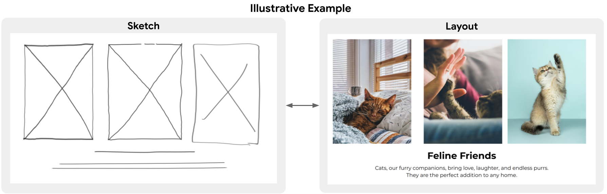

# Dataset - Sketch-to-Layout: Sketch-Guided Multimodal Layout Generation

This is the dataset used and described in `Sketch-to-Layout: Sketch-Guided Multimodal Layout Generation` paper.

The release contains two main types of data:

* The sketched asset primitives in [InkML format](https://www.w3.org/TR/InkML/).
* The layout sketches of: [PubLayNet](https://github.com/ibm-aur-nlp/PubLayNet), [DocLayNet](https://github.com/DS4SD/DocLayNet) and [SlideVQA](https://github.com/nttmdlab-nlp/SlideVQA) synthesized by using the asset primitives. The full process of synthesizing the layouts is described in the paper.


## Sketched Asset Primitives
The sketched asset primitives are obtained by sampling a set of text and image primitives from the PubLayNet, DocLayNet and SlideVQA datasets, and then asking 10 human annotators to draw ink-based sketch primitives on top of these asset primitives. In the end we obtained:

* image primitives: 408
* text primitives: 612

Every sketch primitive is released in InkML format, with an accompanying Notebook showing how to read, visualize them and read their annotation elements.

The following metadata is available for every asset primitive through InkML annotation elements:

* `sourceDataset` being one of `['publaynet', 'doclaynet', 'slidevqa']`, indicating from which dataset does the primitive come from.
* `sourceKey` representing the key of the sample from which the primitive comes from.
* `assetOriginalHeight` representing the assets original height.
* `assetOriginalWidth` representing the assets original width.
* `assetType` being one of `['image', 'text']` representing the asset type.
* `fontSize` is available if the asset is of type text, and it represents the detected font size of the text asset.
* `split` being one of `['train', 'val_test', 'not_used']`, indicating if the primitive was used to generate the training, validation or test datasets or not used at all. A primitive is not used, if it is either of a lower quality, or if it was acquired after generating the final datasets.


## Layout synthesized sketches for PubLayNet, DocLaynet and SlideVQA
To synthesize the layout sketches, for each layout we search for the most similar primitives from the available primitives, we sample from these similar primitives, and create the final synthetic layout. More details can be found in the paper.

The released datasets are in TFRecord format, and each record is a serialized `tf.train.Example` with the following features:

* `example_id` - the key of the layout in bytes format, from the original dataset where it comes from (a key from PubLayNet, DocLaynet or SlideVQA).
* `sketch/encoded` - the bytes of the serialized sketch image representing the layout.

The following datasets and splits are available:

* `publaynet_train.tfrecord@200` - 161_469 examples
* `publaynet_val.tfrecord@100` - 6_471 examples
* `publaynet_test.tfrecord@100` - 6_572 examples
* `doclaynet_train.tfrecord@200` - 28_780 examples
* `doclaynet_val.tfrecord@10` - 2_228 examples
* `doclaynet_test.tfrecord@10` - 2_317 examples
* `slidevqa_train.tfrecord@10` - 16_593 examples
* `slidevqa_val.tfrecord@10` - 4_625 examples
* `slidevqa_test.tfrecord@10` - 6_359 examples

The accompanying Notebook shows how to read and visualize the data.

## Preview Colab Notebook
[](https://colab.research.google.com/github/google-deepmind/sketch_to_layout/blob/master/Sketch_to_Layout_Dataset_Preview.ipynb) - contains steps of how to download and visualize the data.

## Download using CLI

```
# Asset primitives (6.1MB)
wget -nc https://storage.mtls.cloud.google.com/sketch_to_layout_dataset/asset_primitives.tgz

# Generated sketches excerpt (<1MB)
wget -nc https://storage.mtls.cloud.google.com/sketch_to_layout_dataset/generated_sketches_excerpt.tgz

# PubLayNet generated sketches (24.6GB)
wget -nc https://storage.mtls.cloud.google.com/sketch_to_layout_dataset/publaynet_generated_sketches.tgz
# DocLayNet generated sketches (2.2GB)
wget -nc https://storage.mtls.cloud.google.com/sketch_to_layout_dataset/doclaynet_generated_sketches.tgz
# SlideVQA (1.1GB)
wget -nc https://storage.mtls.cloud.google.com/sketch_to_layout_dataset/slidevqa_generated_sketches.tgz
```


## Download links

* [Asset primitives (6.1MB)](https://storage.mtls.cloud.google.com/sketch_to_layout_dataset/asset_primitives.tgz)

* [Generated sketches excerpt (<1MB)](https://storage.mtls.cloud.google.com/sketch_to_layout_dataset/generated_sketches_excerpt.tgz)

* [PubLayNet generated sketches (24.6GB)](https://storage.mtls.cloud.google.com/sketch_to_layout_dataset/publaynet_generated_sketches.tgz)
* [DocLayNet generated sketches (2.2GB)](https://storage.mtls.cloud.google.com/sketch_to_layout_dataset/doclaynet_generated_sketches.tgz)
* [SlideVQA (1.1GB)](https://storage.mtls.cloud.google.com/sketch_to_layout_dataset/slidevqa_generated_sketches.tgz)


## License and disclaimer

Copyright 2024 DeepMind Technologies Limited

All software is licensed under the Apache License, Version 2.0 (Apache 2.0);
you may not use this file except in compliance with the Apache 2.0 license.
You may obtain a copy of the Apache 2.0 license at:
https://www.apache.org/licenses/LICENSE-2.0

All other materials are licensed under the Creative Commons Attribution 4.0
International License (CC-BY). You may obtain a copy of the CC-BY license at:
https://creativecommons.org/licenses/by/4.0/legalcode

Unless required by applicable law or agreed to in writing, all software and
materials distributed here under the Apache 2.0 or CC-BY licenses are
distributed on an "AS IS" BASIS, WITHOUT WARRANTIES OR CONDITIONS OF ANY KIND,
either express or implied. See the licenses for the specific language governing
permissions and limitations under those licenses.

This is not an official Google product.
